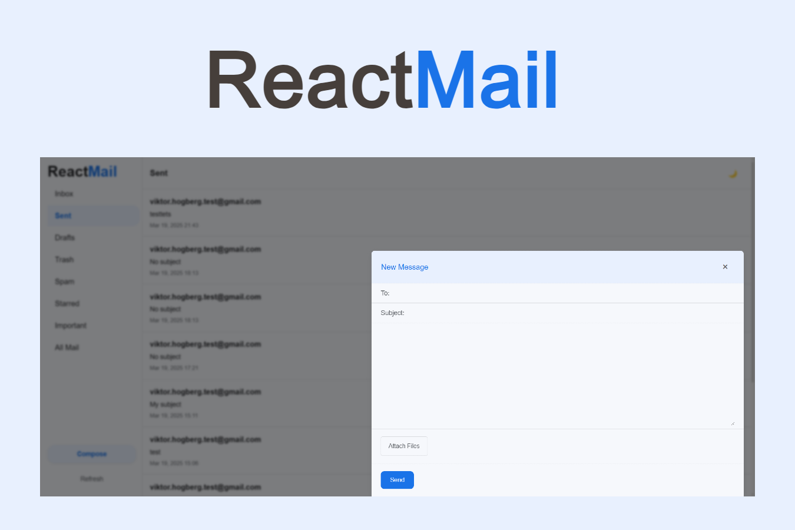

# ReactMail ✉️

A full-featured email client built with a React frontend and Spring Boot backend.

**Watch a demo here:** [https://youtu.be/e3C6jqbHIV0](https://youtu.be/e3C6jqbHIV0)

## Overview

ReactMail is a modern email client application that provides a user-friendly interface for sending and receiving emails. The application features a responsive React frontend with a Java Spring Boot backend following the MVC (Model-View-Controller) architecture.

## Features

- **Complete Email Management**: Send and receive emails
- **File Attachments**: Upload files to send and download received attachments
- **Organized Email Categories**: Inbox, Sent, Trash, Drafts, and other standard email folders
- **Modern React UI**: Clean and responsive user interface
- **RESTful API Backend**: Spring Boot backend handling all email operations

### Key Components

- **EmailController**: Main API controller handling HTTP requests for email operations
  - `receiveEmails`: Fetches emails from the user's mail server
  - `downloadAttachment`: Handles attachment downloads
  - `sendEmail`: Processes and sends new emails
- **Attachment Cache**: Temporary storage for downloaded attachments

## Implementation Notes

The application successfully integrates frontend and backend components to create a seamless email experience. The backend design prioritizes simplicity through Spring Boot's framework, while the React frontend delivers a modern and flexible user interface.

## Current Limitations & Future Improvements

- **Security Enhancements**: Implementation of S/MIME for encryption and digital signatures
- **Draft Auto-saving**: Automatically save drafts while composing
- **Performance Optimization**: Currently limited to fetching the ten most recent emails
- **Additional Email Features**: Advanced filtering, search capabilities, and folder management

## Technologies Used

- React
- Java Spring Boot
- Jakarta Mail
- RESTful API
- MVC Architecture

## License

[MIT License](LICENSE)
